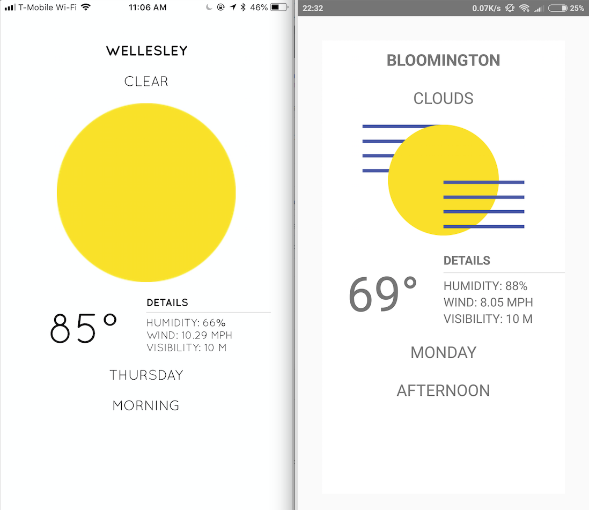

## Lesson 1. Overview

We know we can use Angular to build NativeScript apps, or simply build with "vanilla" NativeScript using JavaScript or TypeScript. But did you know that, due to an amazing community effort led by Developer Expert Igor Randjelovic, we can now use Vue.js as a framework around which to build our apps? Vue.js is an up-and-coming, lightweight JavaScript framework that is gaining in popularity. Learn more about Vue.js [here](https://vuejs.org) and about NativeScript-Vue [here](https://nativescript-vue.org).

In this tutorial, we are going to build a simple weather app, based on a design by  [Gabriel Nazoa](https://www.behance.net/gallery/22645245/Weather-app). 

This weather app, which we'll call "CleanWeather", will allow us to learn how to use geolocation in NativeScript-Vue to get latitude and longitude, and we will use the [OpenWeatherMap](https://openweathermap.org/api) REST API to get that location's weather. In the end, this app will look like this:

Building a weather app is a great proof-of-concept for any mobile app framework, so let's get started. 

