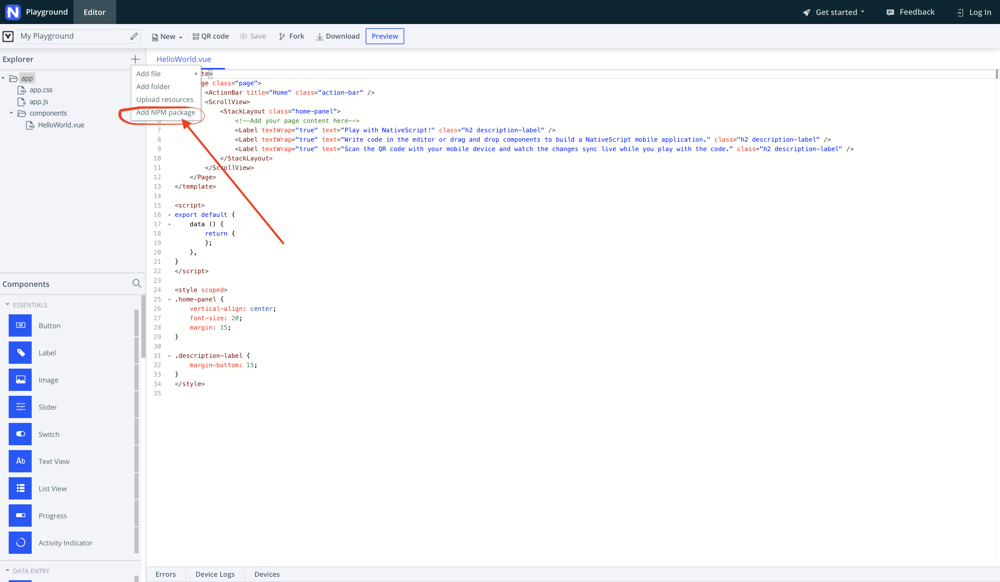
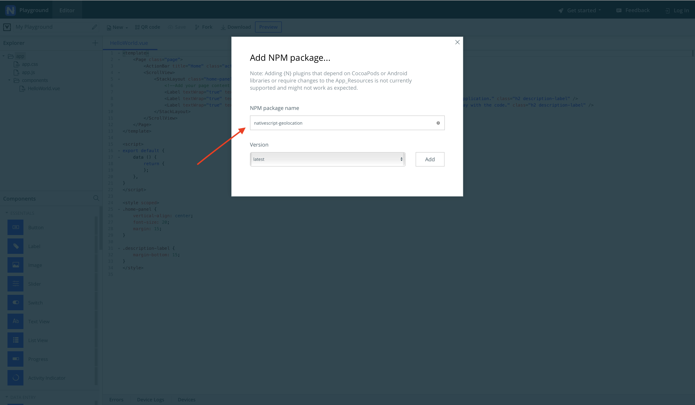

## Lesson 3. Building HelloWorld.vue

Now that you know how to get started with the NativeScript Playground, you can see the folder structure of the existing hello-world project. As you can see in the HelloWorld.vue file listed in components folder, there are three sections in the file, namely template, script and style. 

*  The template defines the user interface much like we see in a HTML page for the web. 
* The script is the JavaScript code we write to define our business logic.
* The style is used to give our user interface further styling using CSS.

We can start by writing the template for the user interface. 

You can replace the existing template code in `HelloWorld.vue` with the one below:

```
<template>
	<Page class="Page" actionBarHidden="true" backgroundSpanUnderStatusBar="true">
		<GridLayout rows="auto,auto">
			<StackLayout row="0">
				<Label class="bold" :text="city"></Label>
				<Label :text="summary"></Label>
				<Image class="weather-image" :src="image" />

				<GridLayout class="weather-box" columns="1*,1*" rows="auto">
					<Label col="0" row="0" class="large" :text="currentTemperature"></Label>
					<StackLayout col="1" row="0">
						<Label class="small bold" text="details"></Label>
						<StackLayout class="hr-light tight"></StackLayout>
						<Label class="small" :text="humidity"></Label>
						<Label class="small" :text="windSpeed"></Label>
						<Label class="small" :text="visibility"></Label>
					</StackLayout>
				</GridLayout>
			
			</StackLayout>
			
			<StackLayout row="1">
				<Label :text="day"></Label>
				<Label :text="time"></Label>
			</StackLayout>
		</GridLayout>
	</Page>
</template>
```

What's going on here? You have created a layout for your app. It has no ActionBar, so you set the `<Page>` element to have `actionBarHidden="true"`. 

Then you created a GridLayout with two rows that contain an area for a city name, the textual summary of weather, and a weather image. Nested in this row is a second GridLayout called "weather=box". In the weather box is the current temperature and weather details including humidity, wind speed, and visibility. This data will be returned by an API that you will query in the next section. 

Right now, you won't see anything on your screen since the `<Label>` elements are bound to returned data. Bound data is indicated by the Vue.js shorthand marker `:` before an element like a Label's text property. The last part of this layout is a second row which will give the current date and time.

To get accurate weather from an API, you need to feed it your latitude and longitude. Thus, you need to use a geolocation module. In NativeScript apps, you can use plugins for special requirements such as this one, so add an npm package called nativescript-geolocation to the app. This can be done in the Playground by pressing the '+' symbol on the explorer and selecting `Add NPM package`. 


Specify nativescript-geolocation to add it to the app. 




You have successfully added the nativescript-geolocation npm package. You'll see a folder added to the `app` folder called `nativescript-geolocation`. 

 > **Note** : 
 > * The full code to build this app can be found [here](https://play.nativescript.org/?template=play-vue&id=E6YWpD&v=6).
 > * If you are interested in learning more about this integration, please visit the #vue channel on NativeScript Community Slack, and read more about it on our [blog](https://www.nativescript.org/search?start=0&q=vue).

In a few lines, you have created a one-page app that has a template and some placeholders for methods that will fill the template's bound components. You've also added a package to geolocate your app.
