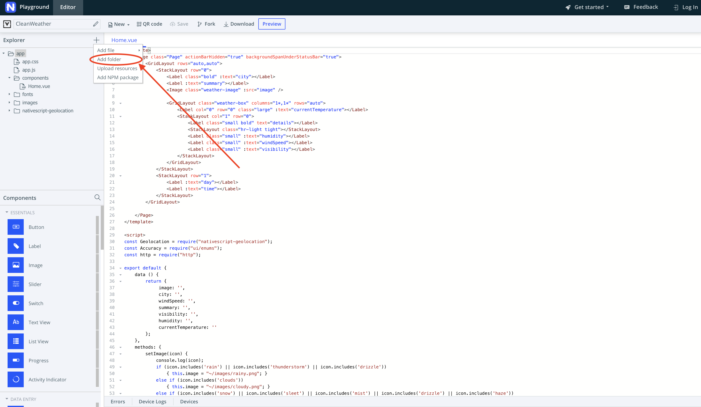

## Lesson 5. Completing the UI

The last thing we need to do is to display an image according to the current forecast. OpenWeatherMap API sends back an icon name with a forecast, so we can use that to build a nice UI.

### Step 1. Upload Assets

First, upload several images. Click the `app` folder name and click `+`. Add one folder called `images` and one called `fonts`. 



Download all the images [here](https://github.com/jlooper/cleanweather/tree/master/app/images) to your local, then upload them to the Playground by clicking on the images folder and choosing 'upload resources'. You can add all the images at once. 

Do the same thing with the two fonts found in [this folder](https://github.com/jlooper/cleanweather/tree/master/app/fonts), saving them to `fonts`. Click `ctrl-S` to save all your files.

> **TIP**:
> * Your current weather might include terms not handled below, so alter the code below if you find that an image is not displayed. Check the included console.log for the name of the icon that is produced by the API.

### Step 2. Use the Images

Add a `setImage` method in our script's method section to handle the display of the image in our app. Put this method right under `methods: {`

```
    setImage(icon) { 
        console.log(icon); 
        if (icon.includes('rain') || icon.includes('thunderstorm') || icon.includes('drizzle'))
			{ this.image = "~/images/rainy.png"; } 
        else if (icon.includes('clouds')) 
        	{ this.image = "~/images/cloudy.png"; } 
        else if (icon.includes('snow') || icon.includes('sleet') || icon.includes('mist') || icon.includes('drizzle') || icon.includes('haze')) 
        	{ this.image = "~/images/foggy.png"; } 
        else if (icon.includes('clear'))
            { this.image = "~/images/sunny.png"; } 
    }, 

```
Test your work by uncommenting `this.setImage(this.icon)` in the `getMyWeather()` method. The image will appear, but it may look pretty big!

### Step 3. Style Your App

It's now time to style the app. Align the style according to the placeholders already placed in the template. Overwrite the entire `<style>` segment:

```
<style scoped>
	Page {
		margin: 30;
	}

	label {
		margin: 10 0;
		font-family: "Quicksand";
		font-size: 20;
		text-transform: uppercase;
		text-align: center;
	}

	.bold {
		font-weight: bold;
	}

	.weather-image {
		margin: 10 50;
	}

	.weather-box {
		margin-top: 10;
	}

	.large {
		font-size: 60;
		vertical-align: top;
	}

	.small {
		font-size: 15;
		margin: 0;
		text-align: left;
	}

	.tight {
		margin: 5
	}

</style>

```

This weather app now looks great! Next steps would include adding a side drawer and the ability to switch between locations. 

Credits: Shantanu Kotambkar, NativeScript Ambassador, and Jen Looper 
