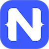
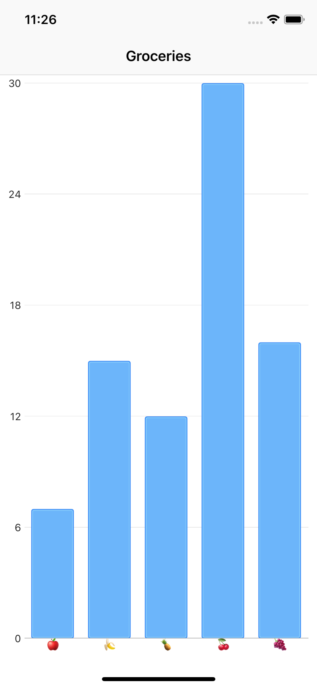
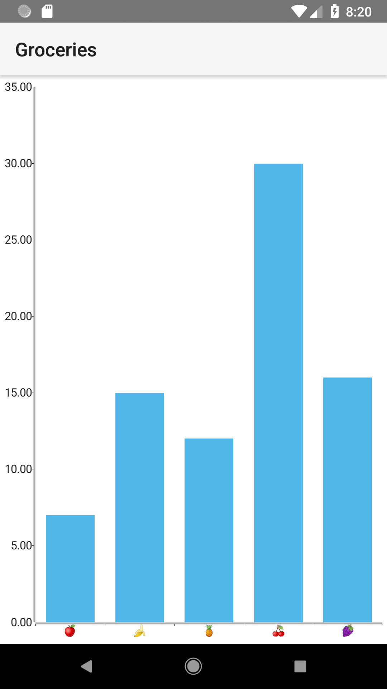

## Lesson 1. Getting Your App Up and Running



Welcome to the NativeScript getting started guide. In this first lesson, you’ll learn what NativeScript is, how to use this Playground environment, and how to get your first app on your device.

> **TIP**:
> * If you run into problems during this guide, the [NativeScript community forum](https://discourse.nativescript.org/) is a great place to reach out for help.
> * The pane you’re viewing this tutorial in is expandable. Try expanding or collapsing it to find a width that works for you.

### Step 1. Starting your first app

The environment you’re in right now is called NativeScript Playground.

NativeScript Playground is a browser-based environment for developing simple NativeScript apps. It’s a great place to get started learning NativeScript, as you can develop apps without needing to install the various SDKs and tools needed for native iOS and Android development. All you need to complete this guide is an iOS or Android device.

> **NOTE**: At the end of this tutorial you’ll learn about the tools you’ll want to use for professional application development, such as [NativeScript Sidekick](https://www.nativescript.org/nativescript-sidekick) and the [NativeScript command-line interface](https://github.com/NativeScript/nativescript-cli).

Let’s see the NativeScript Playground in action.

<hr data-action="start" />

#### Action

* **a.** Get out an Android or iOS device. You need at least one device to complete this tutorial.

* **b.** Download and install the **NativeScript Playground** app on your device by either searching for “NativeScript Playground” in the iOS App Store or Google Play, or by using the links below.

[](https://itunes.apple.com/us/app/nativescript-playground/id1263543946?mt=8&ls=1)
[](https://play.google.com/store/apps/details?id=org.nativescript.play)

* **c.** Download and install the **NativeScript Preview** app on your device by either searching for “NativeScript Preview” in the iOS App Store or Google Play, or by using the links below.

[](https://itunes.apple.com/us/app/nativescript-preview/id1264484702?mt=8)
[](https://play.google.com/store/apps/details?id=org.nativescript.preview)

* **d.** Open the **NativeScript Playground** app on your device(s), and click the **Scan QR code** action.


* **e.** In your web browser, click the **QR Code** button at the top of the Playground interface.


* **f.** Scan the QR code in your browser with your device; you should see a simple “Hello World” app appear.


<hr data-action="end" />

And with that, you’re running your first NativeScript app on your device! Now that you have your app up and running, let’s start tinkering.

### Step 2. Establishing a development workflow

NativeScript lets you develop native iOS and Android apps using JavaScript. One of the advantages of this approach is that NativeScript can update your apps quickly, as NativeScript doesn’t have to run bytecode builds every time a file changes.

Let’s see this in action by making a few updates.

<hr data-action="start" />

#### Action

* **a.** Open your app’s `app/home/home.component.html` file (it might already be open), find the first `<Label>` component (the one with `text="Play with NativeScript!"), and replace that component with the following one.

``` HTML
<Label text="🔥 NativeScript 🔥" fontSize="40"></Label>
```

* **b**. Save the change by typing `Ctrl` + `S` on Windows or `Cmd` + `S` on macOS. The app on your device should automatically update.


> **TIP**
> * You can develop on multiple devices simultaneously. If you have multiple iOS or Android devices, download the **NativeScript Playground** app on each and scan this app’s QR code.
> * In NativeScript Playground the `Ctrl` + `S` or `Cmd` + `S` keyboard shortcut saves all your files. Later in this guide you’ll be changing multiple files, and you can use that single keyboard shortcut to save all of them at the same time.

<hr data-action="end" />

One of the biggest benefits of using NativeScript is the fast development workflow you just saw in action. You have the ability to change your code and see those changes instantly—even on multiple devices.

> **TIP**:
> * You can save your current Playground work by clicking the **Save** button at the top. This will generate a URL that you can bookmark for future use.
> * If you want to continue developing this app locally, you can use the **Download** button at the top of the screen. After you download the app you can continue developing using [NativeScript Sidekick](https://www.nativescript.org/nativescript-sidekick) or the [NativeScript command-line interface](https://docs.nativescript.org/start/quick-setup).

In NativeScript you use native iOS and Android user interface components to build your app; NativeScript does not use a WebView or web browser in any way. This isn’t obvious when using a simple `<Label>`, so let’s make one more change so you can get a sense of just what NativeScript makes possible.

<hr data-action="start" />

#### Action

* **a**. Open your `app/home/home.component.html` file and replace its contents with the following code, which uses NativeScript’s chart UI component.

> **NOTE:** Don’t worry about exactly what this code is doing at the moment. You’ll learn about how Angular and NativeScript work in upcoming tutorials.

``` JavaScript
<ActionBar title="Groceries"></ActionBar>

<GridLayout>
    <RadCartesianChart>
        <CategoricalAxis tkCartesianHorizontalAxis></CategoricalAxis>
        <LinearAxis tkCartesianVerticalAxis></LinearAxis>
        <BarSeries tkCartesianSeries [items]="favoriteFruits" categoryProperty="type" valueProperty="count"></BarSeries>
    </RadCartesianChart>
</GridLayout>
```

* **b.** Next, open your `app/home/home.component.ts` file and replace its contents with the following code.

``` TypeScript
import { Component, OnInit } from "@angular/core";

@Component({
    selector: "Home",
    moduleId: module.id,
    templateUrl: "./home.component.html",
    styleUrls: ['./home.component.css']
})
export class HomeComponent implements OnInit {
    favoriteFruits = [
        { type: "🍎", count: 7 },
        { type: "🍌", count: 15 },
        { type: "🍍", count: 12 },
        { type: "🍒", count: 30 },
        { type: "🍇", count: 16 }
    ];

    constructor() {
    }

    ngOnInit(): void {
    }
}
```

You should see the following charts on your device.




<hr data-action="end" />

You now have an app using completely native iOS and Android charts in a handful of lines of code. Cool, right?

Now that you have some background on how NativeScript Playground works, let’s look at how to build a complete app.

> **TIP:** Take a minute to note the **Errors** section at the bottom of the NativeScript Playground screen. If you hit any errors during these tutorials you’ll see them in this pane.

<!--
## Lesson 2. Building User Interfaces

### Step 3. Using NativeScript’s User Interface Components
### Step 4. Styling Your UIs with CSS
### Step 5. Organizing Your Interfaces with NativeScript Layouts


## Lesson 3. Using Data in Your Apps

### Step 6. Working with Data
### Step 7. Binding to Events
### Step 8. Using the ListView Component

## Lesson 4. Navigation and Networking

### Step 9. Navigating Within Your Apps
### Step 10. Making HTTP Calls

-->